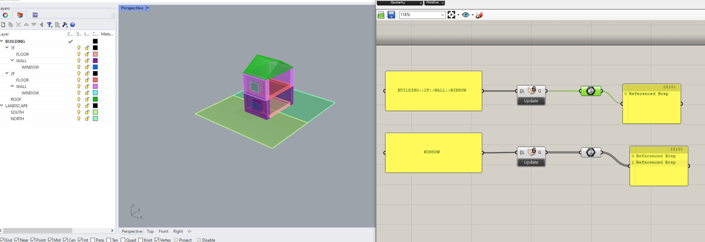
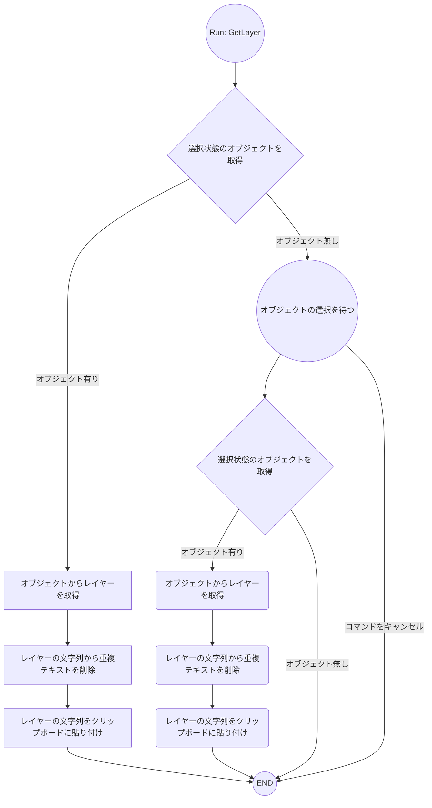

# GET_LAYER_NAME_COMMAND  

※ 2024/07/11  
`GetLayer` から `GetLayerName` にコマンド名を変更しました。  
7/11 以降にダウンロードした人(v4 以降)は、コマンド名が `GetLayerName` となります。  

---  

指定したオブジェクトのレイヤーのフルパスをクリップボードに貼るコマンド。  

オブジェクトを選んだ状態（複数可）で `GetLayerName` を実行 >> クリップボードにテキストとしてレイヤーのフルパスが入ります。  
オブジェクトが選ばれていない状態で `GetLayerName` を実行 >> オブジェクトを選ぶように促されるのでオブジェクトを選ぶと（複数可）、クリップボードにテキストとしてレイヤーのフルパスが入ります。  


紹介記事はこちら  
[https://blog.vicc.jp/entry/get-layer-command](https://blog.vicc.jp/entry/get-layer-command)  


## インストール  

下の URL から rhi をダウンロードして、ダブルクリック。その後、ライノの再起動で反映されるはずです。  
エラーが出たら教えてください。。。  

[https://github.com/viccBlog/20240131_GET_LAYER_COMMAND/releases](https://github.com/viccBlog/20240131_GET_LAYER_COMMAND/releases)  


※うまく動かなければ、それぞれもマシン上で RhinoPython エディタからコンパイルも可能です。  
プログラムはこんな感じ。  

[https://github.com/viccBlog/20240131_GET_LAYER_COMMAND/blob/main/GetLayerName_cmd.py](https://github.com/viccBlog/20240131_GET_LAYER_COMMAND/blob/main/GetLayerName_cmd.py)  


インストール先はここ。何かあればここを確認する。  
```
C:\Users\USER_NAME\AppData\Roaming\McNeel\Rhinoceros\7.0\Plug-ins\PythonPlugins
```

## 動作環境  

下記のバージョンで動作確認しています。  
- Windows10 + Rhino7 SR36  
- Windows11 + Rhino7 SR36  


## モチベーション  

エレフロントで、レイヤー名でオブジェクトを参照することが多い。サブレイヤーが存在する場合に意図したものを取りだそうとするとフルパスを書かなきゃいけないシーンがある。  

下の絵では、2階の窓を取りだそうとしたときに、フルパスではなく WINDOW とだけ指定しているがこれでは1階の窓も合わせて拾われている。かといって階層のあるレイヤーをそれぞれコピペするのは面倒。  

これまでは what コマンドのパネルからのコピペとか、頑張って目で見ながら転記とかで対処していたが、そんなことはせずにオブジェクトのレイヤーを簡単に取得したい。  

  


## こだわりポイント  

- 複数のオブジェクトでも動作する。  
  - 複数オブジェクトの時の気の利いた処理は諦めています（とりあえず全部クリップボードに持ってくるようにした）テキストとして削除するほうが簡単なので、複数のオブジェクトは特別な処理はせず、複数のレイヤーを改行のある文字列としてそのまま返します。  

- オブジェクトを選んだ状態で実行した場合と、オブジェクトが選ばれていない状態で実行した場合のどちらでも動作するようにした。  

- 同じレイヤー名をいくつも持ってきてもあまり意味がないので、それは解消。  


## アルゴリズム  




## Release Note  

- v1  
  - first release  

- v2  
  - 以下のエラーを解決  
    - Message: "global name 'exit' is not defined"  

- v3  
  - `GetLayer` から `GetLayerName` にコマンド名を変更  

- v4  
  - クリップボードの文字列へのソートを追加  


## ref  

- “copy text to clipboard” component?  
  - [https://discourse.mcneel.com/t/copy-text-to-clipboard-component/81366](https://discourse.mcneel.com/t/copy-text-to-clipboard-component/81366)  

- Creating Rhino Commands Using Python  
  - [https://developer.rhino3d.com/guides/rhinopython/creating-rhino-commands-using-python/#windows](https://developer.rhino3d.com/guides/rhinopython/creating-rhino-commands-using-python/#windows)  

- Create RHI File  
  - [https://developer.rhino3d.com/guides/rhinopython/creating-rhino-commands-using-python/#creating-an-rhi-installer](https://developer.rhino3d.com/guides/rhinopython/creating-rhino-commands-using-python/#creating-an-rhi-installer)  
